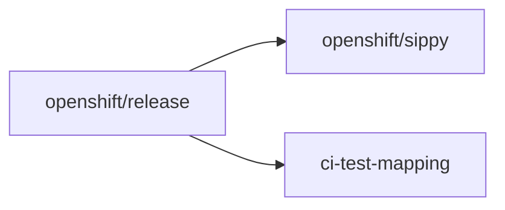

# My-poc LP OCP Compat Component Readiness Onboarding Report

Documentation-only proof of concept generated by the [lp-ocp-compat-cr-onboarding](.cursor/skills/lp-ocp-compat-cr-onboarding/SKILL.md) skill. Mock PR content is structurally valid for onboarding; no branches were pushed to origin and no upstream PRs were opened.

## Invocation

```text
/lp-ocp-compat-cr-onboarding lp-name=My-poc lp-slug=my-poc lp-repo=redhatqe/my-poc lp-branch=main lp-ver=lpGA ocp-release=4.22 release-config=ci-operator/config/redhatqe/my-poc/redhatqe-my-poc-main__ocp-4.22-lpGA-lp-ocp-compat.yaml test-variant=aws gh-user=oharan2 make-maintainer=user
```

## Derived identifier table

| Identifier | Value |
|------------|-------|
| `DR__RP__CR_COMP_NAME` / TS prefix | `lp-ocp-compat--My-poc` |
| CI Operator Job Conf. `.tests[].as` | `cr--my-poc--aws` |
| Periodic CI Operator Job name | `periodic-ci-redhatqe-my-poc-main-ocp-4.22-lpGA-lp-ocp-compat-cr--my-poc--aws` |
| Sippy `layeredProductPatterns` sub-string | `-lpga-lp-ocp-compat-cr--my-poc--` |
| Sippy CR Variant `LayeredProduct` | `lp-ocp-compat--my-poc--lpGA` |
| CR View (`view=`) | `4.22-LP-OCP-Compat--lpGA` |
| ci-test-mapping Go package | `lpmypoc` |
| Jira / CR Component | `LP--My-poc` |
| `SuiteRegEx` | ``^lp-ocp-compat--My-poc--`` |
| Registry symbol | `LPmypocComponent` |
| Feature branch (all repos) | `my-poc` |
| Commit message tag | `[ocp-ci-docs] lp-ocp-compat-cr-onboarding` |

## Mock pull request links

These are mock compare links for the documented branch `oharan2:my-poc`. No push to origin was performed.

| # | Upstream repo | Mock PR link | Title |
|---|---------------|--------------|-------|
| 1 | [openshift/release](https://github.com/openshift/release) | [Compare: main...oharan2:my-poc (mock)](https://github.com/openshift/release/compare/main...oharan2:my-poc?expand=1) | Onboard My-poc for LP OCP Compat Component Readiness (release) |
| 2 | [openshift/sippy](https://github.com/openshift/sippy) | [Compare: main...oharan2:my-poc (mock)](https://github.com/openshift/sippy/compare/main...oharan2:my-poc?expand=1) | Onboard My-poc for LP OCP Compat Component Readiness (Sippy) |
| 3 | [openshift-eng/ci-test-mapping](https://github.com/openshift-eng/ci-test-mapping) | [Compare: main...oharan2:my-poc (mock)](https://github.com/openshift-eng/ci-test-mapping/compare/main...oharan2:my-poc?expand=1) | Onboard My-poc for LP OCP Compat Component Readiness (ci-test-mapping) |

Cross-links to include in each PR body:

- Release: https://github.com/openshift/release/compare/main...oharan2:my-poc?expand=1
- Sippy: https://github.com/openshift/sippy/compare/main...oharan2:my-poc?expand=1
- ci-test-mapping: https://github.com/openshift-eng/ci-test-mapping/compare/main...oharan2:my-poc?expand=1

## PR 1: openshift/release (mock)

**Branch:** `my-poc` on fork `oharan2/release`

**File:** `ci-operator/config/redhatqe/my-poc/redhatqe-my-poc-main__ocp-4.22-lpGA-lp-ocp-compat.yaml`

```yaml
tests:
  - as: cr--my-poc--aws
    cron: 0 6,18 * * *
    steps:
      env:
        MAP_TESTS: "true"
        DR__RP__CR_COMP_NAME: lp-ocp-compat--My-poc
```

**Maintainer hand-off:** `make jobs` (not run; `make-maintainer=user`).

**Verification:** After a CI Operator Job Run, JUnit XML under the Test Step artifacts must show `<testsuite name="lp-ocp-compat--My-poc--...">`.

### PR 1 body (paste-ready)

```markdown
## Summary

Onboard My-poc LP OCP Compat CI Operator Job for Component Readiness.

[ocp-ci-docs] lp-ocp-compat-cr-onboarding

## Related PRs

- Sippy: https://github.com/openshift/sippy/compare/main...oharan2:my-poc?expand=1
- ci-test-mapping: https://github.com/openshift-eng/ci-test-mapping/compare/main...oharan2:my-poc?expand=1

## Identifier table

| Identifier | Value |
|------------|-------|
| `DR__RP__CR_COMP_NAME` | `lp-ocp-compat--My-poc` |
| `.tests[].as` | `cr--my-poc--aws` |
| Periodic CI Operator Job name | `periodic-ci-redhatqe-my-poc-main-ocp-4.22-lpGA-lp-ocp-compat-cr--my-poc--aws` |

## Maintainer actions (not run by submitter)

- `make jobs`
```

---

## PR 2: openshift/sippy (mock)

**Branch:** `my-poc` on fork `oharan2/sippy`

**File:** `pkg/variantregistry/ocp.go` (inside `layeredProductPatterns` in `setLayeredProduct()`)

```go
{"-lpga-lp-ocp-compat-cr--my-poc--", "lp-ocp-compat--my-poc--lpGA"},
```

**File:** `config/views.yaml` (inside the `4.22-LP-OCP-Compat--lpGA` block, alphabetically sorted)

```yaml
    LayeredProduct:
      - lp-ocp-compat--my-poc--lpGA
```

**Files skipped (standard LP OCP Compat):** Step 1 BigQuery pattern, Step 2 `setOwner`, Step 6 `testSuitePatterns`.

**Maintainer hand-off:**

- `make update-variants`
- `./sippy variants snapshot --config ./config/openshift.yaml`
- Commit regenerated `pkg/variantregistry/snapshot.yaml`

### PR 2 body (paste-ready)

```markdown
## Summary

Register My-poc LayeredProduct variant and CR View entry for LP OCP Compat.

[ocp-ci-docs] lp-ocp-compat-cr-onboarding

## Related PRs

- release: https://github.com/openshift/release/compare/main...oharan2:my-poc?expand=1
- ci-test-mapping: https://github.com/openshift-eng/ci-test-mapping/compare/main...oharan2:my-poc?expand=1

## Identifier table

| Identifier | Value |
|------------|-------|
| `layeredProductPatterns` sub-string | `-lpga-lp-ocp-compat-cr--my-poc--` |
| CR Variant `LayeredProduct` | `lp-ocp-compat--my-poc--lpGA` |
| CR View | `4.22-LP-OCP-Compat--lpGA` |

## Maintainer actions (not run by submitter)

- `make update-variants`
- `./sippy variants snapshot --config ./config/openshift.yaml`
```

---

## PR 3: openshift-eng/ci-test-mapping (mock)

**Branch:** `my-poc` on fork `oharan2/ci-test-mapping`

**File:** `pkg/components/lpmypoc/component.go`

```go
package lpmypoc

import (
    "regexp"

    v1 "github.com/openshift-eng/ci-test-mapping/pkg/api/types/v1"
    "github.com/openshift-eng/ci-test-mapping/pkg/config"
)

type Component struct {
    *config.Component
}

var LPmypocComponent = Component{
    Component: &config.Component{
        Name:                 "LP--My-poc",
        Operators:            []string{},
        DefaultJiraComponent: "LP--My-poc",
        Matchers: []config.ComponentMatcher{
            {SuiteRegEx: regexp.MustCompile(`^lp-ocp-compat--My-poc--`)},
        },
    },
}

func (c *Component) IdentifyTest(test *v1.TestInfo) (*v1.TestOwnership, error) {
    if matcher := c.FindMatch(test); matcher != nil {
        jira := matcher.JiraComponent
        if jira == "" {
            jira = c.DefaultJiraComponent
        }
        return &v1.TestOwnership{
            Name:           test.Name,
            Component:      c.Name,
            JIRAComponent:  jira,
            Priority:       matcher.Priority,
            Capabilities:   append(matcher.Capabilities, identifyCapabilities(test)...),
        }, nil
    }
    return nil, nil
}

func (c *Component) StableID(test *v1.TestInfo) string {
    if stableName, ok := c.TestRenames[test.Name]; ok {
        return stableName
    }
    return test.Name
}

func (c *Component) JiraComponents() (components []string) {
    components = []string{c.DefaultJiraComponent}
    for _, m := range c.Matchers {
        components = append(components, m.JiraComponent)
    }
    return components
}
```

**File:** `pkg/components/lpmypoc/capabilities.go`

```go
package lpmypoc

import (
    v1 "github.com/openshift-eng/ci-test-mapping/pkg/api/types/v1"
    "github.com/openshift-eng/ci-test-mapping/pkg/util"
)

func identifyCapabilities(test *v1.TestInfo) []string {
    capabilities := util.DefaultCapabilities(test)
    return capabilities
}
```

**File:** `pkg/registry/registry.go` (add import and registration in `NewComponentRegistry()`)

```go
    "github.com/openshift-eng/ci-test-mapping/pkg/components/lpmypoc"
```

```go
    r.Register("LP--My-poc", &lpmypoc.LPmypocComponent)
```

**File skipped:** `config/openshift-eng.yaml` (`lp-ocp-compat--%` already covers TS names).

**Maintainer hand-off:** `make mapping`; commit regenerated `mapping.json`.

### PR 3 body (paste-ready)

```markdown
## Summary

Add My-poc CR Component mapping for LP OCP Compat Test Suites.

[ocp-ci-docs] lp-ocp-compat-cr-onboarding

## Related PRs

- release: https://github.com/openshift/release/compare/main...oharan2:my-poc?expand=1
- Sippy: https://github.com/openshift/sippy/compare/main...oharan2:my-poc?expand=1

## Identifier table

| Identifier | Value |
|------------|-------|
| Go package | `lpmypoc` |
| CR Component | `LP--My-poc` |
| Jira Component | `LP--My-poc` |
| `SuiteRegEx` | ``^lp-ocp-compat--My-poc--`` |

## Maintainer actions (not run by submitter)

- `make mapping`
```

---

## Implementation order



Release PR first to confirm JUnit TS prefix; Sippy and ci-test-mapping PRs can follow in parallel once verified.

## Post-merge verification

Open [4.22-LP-OCP-Compat--lpGA](https://sippy.dptools.openshift.org/sippy-ng/component_readiness/main?view=4.22-LP-OCP-Compat--lpGA) and confirm `LP--My-poc` appears after data ingestion.

## Run artifacts

| Artifact | Path |
|----------|------|
| Run log | [.cursor/skills/lp-ocp-compat-cr-onboarding/runs/LP_OCP_Compat_CR_Run_My-poc_20260531_log.md](.cursor/skills/lp-ocp-compat-cr-onboarding/runs/LP_OCP_Compat_CR_Run_My-poc_20260531_log.md) |
| Shell trace | [.cursor/skills/lp-ocp-compat-cr-onboarding/runs/LP_OCP_Compat_CR_Run_My-poc_20260531_commands.sh](.cursor/skills/lp-ocp-compat-cr-onboarding/runs/LP_OCP_Compat_CR_Run_My-poc_20260531_commands.sh) |

## References

- [Reporting Guide, Component Readiness](docs/OCP_CI_Tutorials/Reporting/Reporting_Guide.md#component-readiness)
- [Worked example: MPEXOperator](.cursor/skills/lp-ocp-compat-cr-onboarding/references/worked-example-mpexoperator.md)
